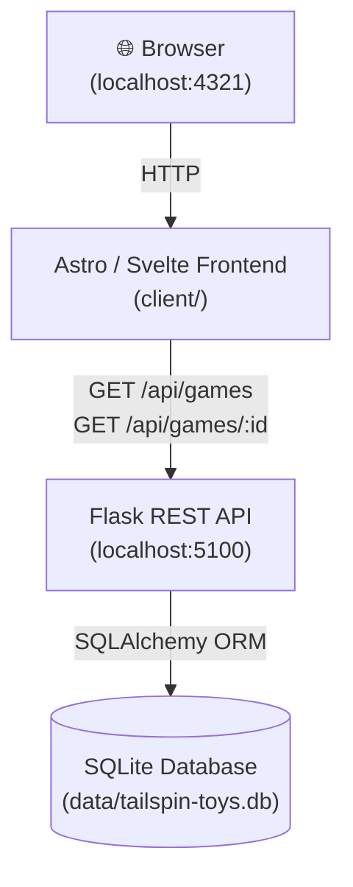
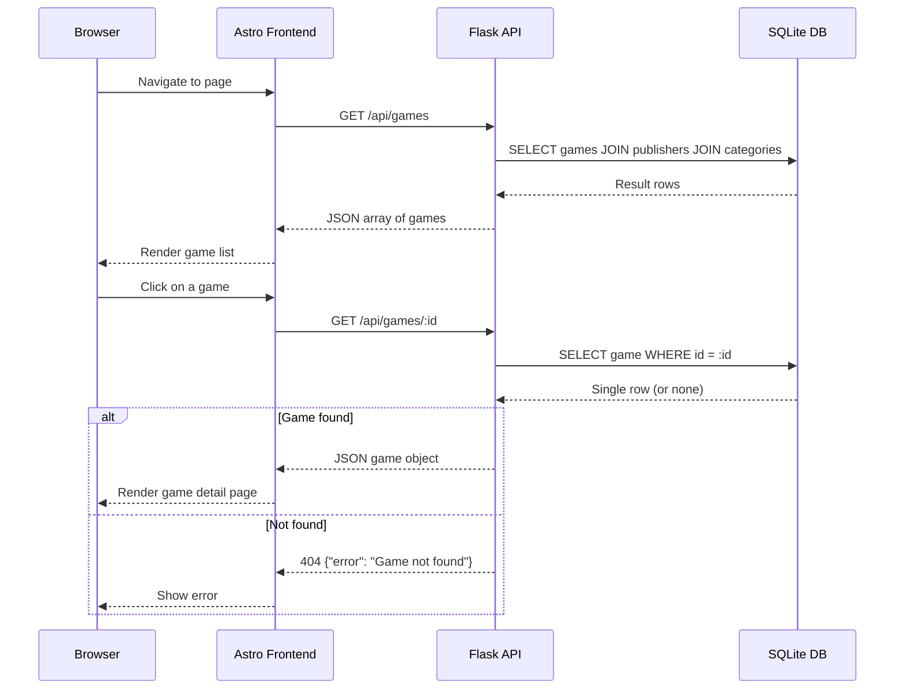
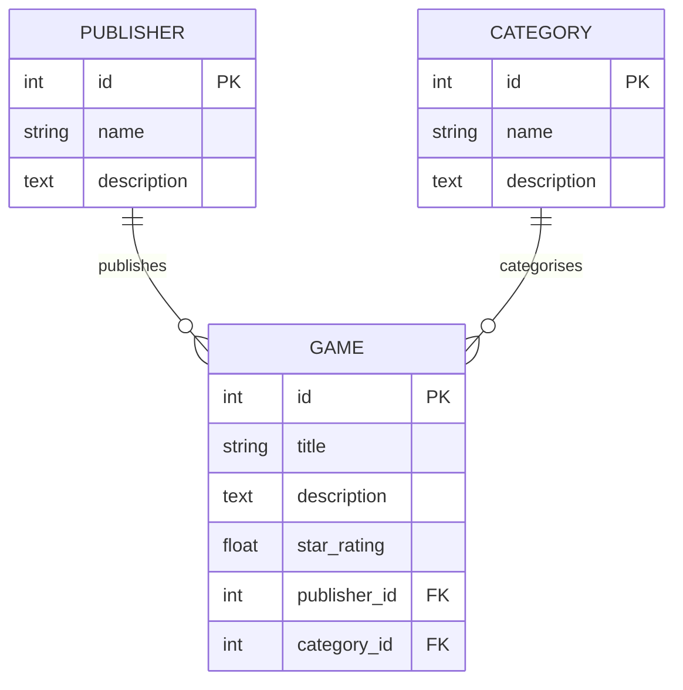

# Tailspin Toys

[](https://github.com/se-copilot-workshops/agents-in-sdlc/actions/workflows/deploy-pages.yml)

Tailspin Toys is a fictional crowdfunding platform for board games with a DevOps theme. This repository is also a guided workshop to explore **GitHub Copilot Agent Mode** and related features in Visual Studio Code.

> To begin the workshop, start at [docs/README.md](./docs/README.md) or visit **https://connect.copilot-workshops.com**

## Table of Contents

- [Tech Stack](#tech-stack)
- [Project Structure](#project-structure)
- [Prerequisites](#prerequisites)
- [Installation & Setup](#installation--setup)
- [Running the Application](#running-the-application)
- [API Reference](#api-reference)
- [Testing](#testing)
- [Scripts](#scripts)
- [Documentation](#documentation)
- [License](#license)
- [Support](#support)

## Tech Stack

| Layer    | Technology                                                                    |
| -------- | ----------------------------------------------------------------------------- |
| Backend  | [Python](https://python.org) · [Flask](https://flask.palletsprojects.com/) · [SQLAlchemy](https://www.sqlalchemy.org/) · SQLite |
| Frontend | [Astro](https://astro.build/) · [Svelte](https://svelte.dev/) · [Tailwind CSS](https://tailwindcss.com/) · TypeScript |
| Testing  | `unittest` (backend) · [Playwright](https://playwright.dev/) (end-to-end) |

## Architecture



## Project Structure

```text
.
├── client/                  # Astro/Svelte frontend
│   ├── src/
│   │   ├── components/      # Reusable Svelte components
│   │   │   ├── GameList.svelte
│   │   │   ├── GameDetails.svelte
│   │   │   └── Header.astro
│   │   ├── layouts/         # Astro layout templates
│   │   ├── pages/           # Astro page routes
│   │   │   ├── index.astro  # Home / games listing
│   │   │   ├── about.astro  # About page
│   │   │   └── game/
│   │   │       └── [id].astro  # Dynamic game detail page
│   │   └── styles/          # CSS and Tailwind configuration
│   ├── e2e-tests/           # Playwright end-to-end tests
│   └── package.json
├── server/                  # Flask backend
│   ├── app.py               # Application entry point
│   ├── models/              # SQLAlchemy ORM models
│   │   ├── game.py          # Game model
│   │   ├── publisher.py     # Publisher model
│   │   └── category.py      # Category model
│   ├── routes/              # API endpoints (Flask Blueprints)
│   │   ├── games.py         # /api/games endpoints
│   │   └── publishers.py    # /api/publishers endpoints
│   ├── utils/               # Utility functions
│   │   ├── database.py      # Database initialization helper
│   │   └── seed_database.py # Database seeding script
│   ├── tests/               # Unit tests
│   └── requirements.txt
├── data/                    # SQLite database files
├── docs/                    # Workshop documentation (published to GitHub Pages)
└── scripts/                 # Development helper scripts
```

## Prerequisites

- **Python 3.10+** with `pip`
- **Node.js 18+** with `npm`
- A Unix-like shell (bash). On Windows, use Git Bash or WSL.

## Installation & Setup

A single script installs all Python and Node dependencies and sets up a Python virtual environment:

```bash
./scripts/setup-env.sh
```

The script is also called automatically by the other helper scripts, so you only need to run it manually if you want to set up the environment without starting the app.

## Running the Application

### Start both servers (recommended)

```bash
./scripts/start-app.sh
```

This starts:
- **Flask API** at `http://localhost:5100`
- **Astro frontend** at `http://localhost:4321`

Open [http://localhost:4321](http://localhost:4321) in your browser to view the site.

### Start servers individually

**Backend (Flask)**

```bash
cd server
python3 app.py
```

**Frontend (Astro)**

```bash
cd client
npm run dev
```

## API Reference

The Flask backend exposes a JSON REST API. All endpoints are prefixed with `/api`.

### API Request Flow



### Games

| Method | Endpoint          | Description                     |
| ------ | ----------------- | ------------------------------- |
| GET    | `/api/games`      | Returns a list of all games     |
| GET    | `/api/games/<id>` | Returns a single game by its ID |

**Game object**

```json
{
  "id": 1,
  "title": "Board Quest",
  "description": "An epic strategy game...",
  "publisher": { "id": 2, "name": "Acme Games" },
  "category":  { "id": 1, "name": "Strategy" },
  "starRating": 4.5
}
```

**Error responses**

| Status | Body                          | When                   |
| ------ | ----------------------------- | ---------------------- |
| 404    | `{"error": "Game not found"}` | Game ID does not exist |

### Data Models



| Model       | Fields                                                     |
| ----------- | ---------------------------------------------------------- |
| `Game`      | `id`, `title`, `description`, `star_rating`, `category_id`, `publisher_id` |
| `Publisher` | `id`, `name`, `description`                                |
| `Category`  | `id`, `name`, `description`                                |

## Testing

### Backend unit tests

```bash
./scripts/run-server-tests.sh
```

Tests are located in `server/tests/` and use Python's built-in `unittest` module with an in-memory SQLite database.

### Frontend end-to-end tests

```bash
cd client
npx playwright test
```

Playwright tests are located in `client/e2e-tests/`.

## Scripts

| Script                       | Description                                                      |
| ---------------------------- | ---------------------------------------------------------------- |
| `scripts/setup-env.sh`       | Installs all Python and Node dependencies                        |
| `scripts/start-app.sh`       | Calls `setup-env`, then starts both the Flask and Astro servers  |
| `scripts/run-server-tests.sh`| Calls `setup-env`, then runs all Python backend unit tests       |

## Documentation

The complete workshop documentation lives in the `docs/` directory and is automatically deployed to GitHub Pages on every push to `main`:

**https://connect.copilot-workshops.com**

## License

This project is licensed under the terms of the MIT open source license. Please refer to [LICENSE](./LICENSE) for the full terms.

## Maintainers

You can find the list of maintainers in [CODEOWNERS](./.github/CODEOWNERS).

## Support

This project is provided as-is and may be updated over time. If you have questions, please open an issue.
